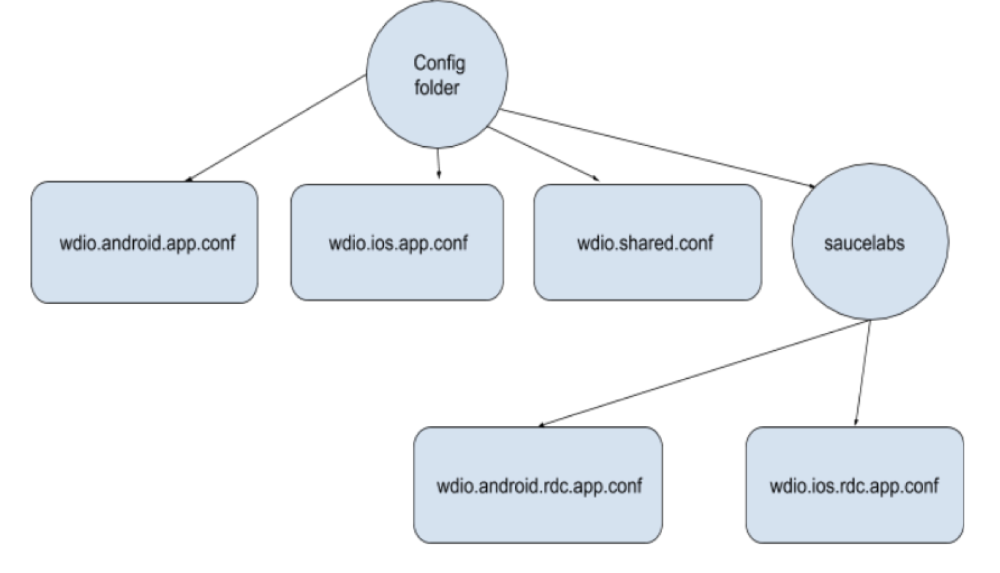
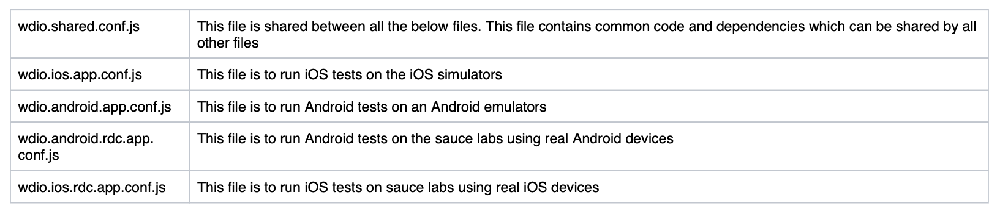

# WebdriverIO Cucumber Appium Automation Boilerplate 

Boilerplate project to run Appium tests together with WebdriverIO and BDD with cucumber for iOS / Android apps

> This boilerplate uses the WebdriverIO native demo app which, the version of the app used in this boilerplate is in the apps folder, other versions can be found at this link [release](https://github.com/webdriverio/native-demo-app/releases).
> Before running tests, please replace the App in the `./apps` directory with your app.

## Requirements
- node >= 13.x.x - [how to install Node](https://nodejs.org/en/download/)

## Project Structure
This project uses [Cucumber](https://cucumber.io/), and as such [Gherkin](https://cucumber.io/docs/gherkin/) syntax to write `.feature` files. These have the following syntax:

```Gherkin
Feature: State what feature the file is testing
	Give detail on what this file is testing 

Scenario: What scenario is being test
	Given the system is in a certain state
	And the system is also in another state
	When an action is performed
	Then something should happen
```

## Installing Appium on a local machine
See [Installing Appium on a local machine](http://appium.io/docs/en/about-appium/getting-started/)

## Getting Started
Install the dependencies:
```bash
$ npm install
```

Start the appium server:
```bash
$ appium
```
>The `@wdio/appium-service` is integrated in this boilerplate so you don't need to start an Appium server yourself, WebdriverIO will do that for you.

## Config architecture:
This boilerplate uses a specific config for iOS and Android, see [configs](./config/) and are based on `wdio.shared.conf.js`.
This shared config holds all the defaults so the iOS and Android configs only need to hold the capabilities and steps that are needed for running on iOS and or Android.



## Details of each file:



## To run tests locally:
```bash
// For Android in emulator
$ npm run test-android -- --device='<device name>' --version='<device version>' --platform='Android'

// For iOS in simulator
$ npm run test-ios -- --device='<device name>' --version='<device version>' --platform='iOS'
```

Since we do not have Appium installed as part of this package, this has been configured to use the global Appium installation. This is configured in wdio.shared.conf.js
```
appium: {
    command : 'appium'
},
```
## Environment variables:
Create a `.env` file in the project root directory. Using this will mean that emails / passwords will not be committed to GitHub, but instead will be read from the user's `.env` file. An [.env.example](./.env.example) exist already, this is to be used as a template. In the actual `.env` file, copy the template over and replace the `<your email for economist.com>` and `<your password>` with the appropriate text.

```bash
#EXAMPLE:
#Change the text in the quotes to your email and password.
USERNAME="<your email>"
PASSWORD="<your password>"
```

## Eslint and gherkin linter

Run eslint lint:

```bash
$ npm run code:lint
```

Run eslint lint fix:

```bash
$ npm run code:lint-fix
```

Run gherkin lint:

```bash
$ npm run gherkin-linter
```

## Cloud vendors

### Sauce Labs Real Device Cloud
This boilerplate now also provides a setup for testing with the Real Device Cloud (RDC) of Sauce Labs. Please check the [SauceLabs](./config/saucelabs)-folder to see the setup for iOS and Android.

> With the latest version of WebdriverIO the iOS and Android config holds: 
> - automatic US or EU RDC cloud selection by providing a `region` in the config, see the [iOS](./config/saucelabs/wdio.ios.rdc.app.conf.js) and the [Android](./config/saucelabs/wdio.android.rdc.app.conf.js) configs 

There are 2 scripts that can be used, see the [`package.json`](./package.json), to execute the tests in the cloud:

    // For Android in sauce labs
    $ npm run test-android-saucelabs -- --device='<device name>' --version='device version' --platform='Android'
    
    // For Android
    $ npm run test-ios-Saucelabs -- --device='<device name>' --version='device version' --platform='iOS'
